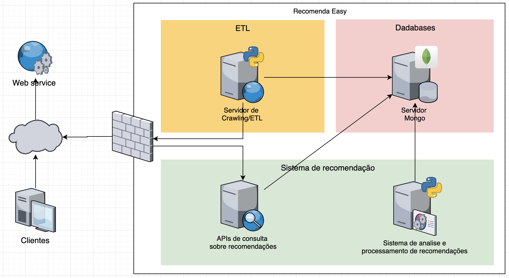

# Recomenda EASY



## Rodando Localmente
- Precisa de Python 3.7 [installed locally](http://install.python-guide.org).
- Banco de dados [MongoDb](https://docs.mongodb.com/manual/installation/).
- Heroku CLI para rodar local e deploy [Heroku CLI](https://devcenter.heroku.com/articles/heroku-cli)

```sh
# Clone the repository
$ git clone TODO
$ cd recomenda_easy

# Copy the sample env
$ cp sample.env .env

# Create a Python virtual environment
$ python -m venv env
$ source env/bin/activate

# Install dependecies
$ pip install -r requirements.txt

$ python run.py
```

Your app should now be running on [localhost:3000](http://localhost:3000/).

## Livros e comentarios Crawler
```sh
# Criação dos arquivos JSON
$ scrapy runspider tccScrapperBooks.py -o livros.json
$ scrapy runspider tccScrapperComments.py -o comments.json

# Transformação dos comentarios
$ python transformationComments.py

# Importa no banco de dados Mongo.
$ mongoimport -h HOST -d DATABASE -c books -u USER -p PASSWORD --file livros.json --jsonArray
$ mongoimport -h HOST -d DATABASE -c comments -u USER -p PASSWORD --file comments.json --jsonArray
```


## Deploying to Heroku

```sh
$ heroku create
$ git push heroku master
$ heroku open
```
ou

[](https://heroku.com/deploy)

## Documentation
 TODO
